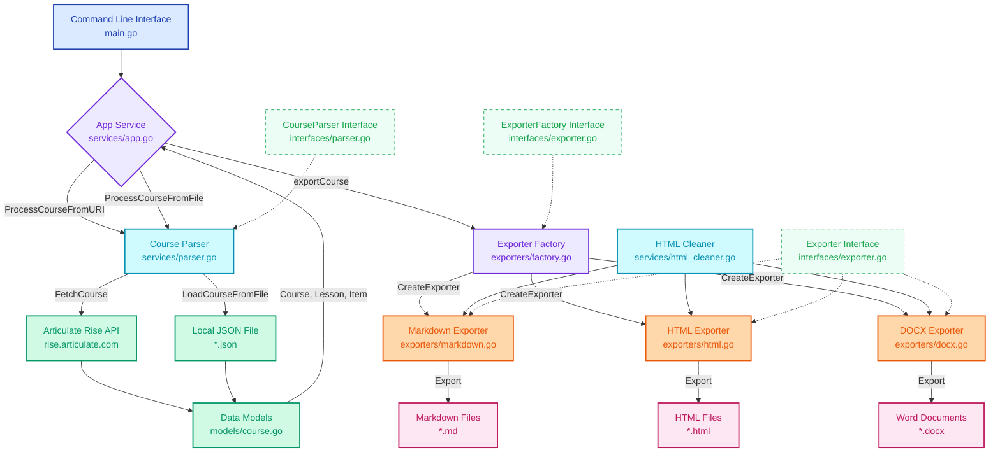

# Articulate Rise Parser

A Go-based parser that converts Articulate Rise e-learning content to various formats including Markdown, HTML, and Word documents.

[][gomod]
[][Package documentation]
[][Go report]
[][Tags] <!-- [][Latest release] -->
[][MIT License] <!-- [][Commits] -->
[][Commits]
[][Issues]
[][Build]
[][Docker workflow]
[][Docker image]
[][Codecov]

## System Architecture



### Architecture Overview

The system follows **Clean Architecture** principles with clear separation of concerns:

-   **🎯 Entry Point**: Command-line interface handles user input and coordinates operations
-   **🏗️ Application Layer**: Core business logic with dependency injection
-   **📋 Interface Layer**: Contracts defining behavior without implementation details  
-   **🔧 Service Layer**: Concrete implementations of parsing and utility services
-   **📤 Export Layer**: Factory pattern for format-specific exporters
-   **📊 Data Layer**: Domain models representing course structure

## Features

-   Parse Articulate Rise JSON data from URLs or local files
-   Export to Markdown (.md) format
-   Export to HTML (.html) format with professional styling
-   Export to Word Document (.docx) format
-   Support for various content types:
    -   Text content with headings and paragraphs
    -   Lists and bullet points
    -   Multimedia content (videos and images)
    -   Knowledge checks and quizzes
    -   Interactive content (flashcards)
    -   Course structure and metadata

## Installation

### Prerequisites

-   Go, I don't know the version, but I have [][gomod] configured right now, and it works, see the [CI][Build] workflow where it is tested.

### Install from source

```bash
git clone https://github.com/kjanat/articulate-parser.git
cd articulate-parser
go mod download
go build -o articulate-parser main.go
```

### Or install directly

```bash
go install github.com/kjanat/articulate-parser@latest
```

## Dependencies

The parser uses the following external library:

-   `github.com/fumiama/go-docx` - For creating Word documents (MIT license)

## Testing

Run the test suite:

```bash
go test ./...
```

Run tests with coverage:

```bash
go test -v -race -coverprofile=coverage.out ./...
```

View coverage report:

```bash
go tool cover -html=coverage.out
```

## Usage

### Command Line Interface

```bash
go run main.go <input_uri_or_file> <output_format> [output_path]
```

#### Parameters

| Parameter           | Description                                                      | Default         |
| ------------------- | ---------------------------------------------------------------- | --------------- |
| `input_uri_or_file` | Either an Articulate Rise share URL or path to a local JSON file | None (required) |
| `output_format`     | `md` for Markdown, `html` for HTML, or `docx` for Word Document  | None (required) |
| `output_path`       | Path where output file will be saved.                            | `./output/`     |

#### Examples

1.  **Parse from URL and export to Markdown:**

```bash
go run main.go "https://rise.articulate.com/share/N_APNg40Vr2CSH2xNz-ZLATM5kNviDIO#/" md
```

2.  **Parse from local file and export to Word:**

```bash
go run main.go "articulate-sample.json" docx "my-course.docx"
```

3.  **Parse from local file and export to HTML:**

```bash
go run main.go "articulate-sample.json" html "output.html"
```

4.  **Parse from local file and export to Markdown:**

```bash
go run main.go "articulate-sample.json" md "output.md"
```

### Building the Executable

To build a standalone executable:

```bash
go build -o articulate-parser main.go
```

Then run:

```bash
./articulate-parser input.json md output.md
```

## Docker

The application is available as a Docker image from GitHub Container Registry.

### Quick Start

```bash
# Pull the latest image
docker pull ghcr.io/kjanat/articulate-parser:latest

# Show help
docker run --rm ghcr.io/kjanat/articulate-parser:latest --help
```

### Usage Examples

#### Process a local file

```bash
# Mount current directory and process a local JSON file
docker run --rm -v $(pwd):/workspace \
  ghcr.io/kjanat/articulate-parser:latest \
  /workspace/input.json markdown /workspace/output.md
```

#### Process from URL

```bash
# Mount output directory and process from Articulate Rise URL
docker run --rm -v $(pwd):/workspace \
  ghcr.io/kjanat/articulate-parser:latest \
  "https://rise.articulate.com/share/xyz" docx /workspace/output.docx
```

#### Export to different formats

```bash
# Export to HTML
docker run --rm -v $(pwd):/workspace \
  ghcr.io/kjanat/articulate-parser:latest \
  /workspace/course.json html /workspace/course.html

# Export to Word Document
docker run --rm -v $(pwd):/workspace \
  ghcr.io/kjanat/articulate-parser:latest \
  /workspace/course.json docx /workspace/course.docx
```

### Available Tags

- `latest` - Latest stable release from master branch
- `edge` - Latest development build from master branch  
- `v1.x.x` - Specific version releases
- `develop` - Development branch builds
- `feature/docker-ghcr` - Feature branch builds (temporary)

### Docker Compose

For local development, you can use the provided `docker-compose.yml`:

```bash
# Build and run with default help command
docker-compose up articulate-parser

# Process files using mounted volumes
docker-compose up parser-with-files
```

### Building Locally

```bash
# Build the Docker image locally
docker build -t articulate-parser:local .

# Run the local image
docker run --rm articulate-parser:local --help
```

## Development

### Code Quality

The project maintains high code quality standards:

-   Cyclomatic complexity ≤ 15 (checked with [gocyclo](https://github.com/fzipp/gocyclo))
-   Race condition detection enabled
-   Comprehensive test coverage
-   Code formatting with `gofmt`
-   Static analysis with `go vet`

### Contributing

1.  Fork the repository
2.  Create a feature branch
3.  Make your changes
4.  Run tests: `go test ./...`
5.  Submit a pull request

## Output Formats

### Markdown (`.md`)

-   Hierarchical structure with proper heading levels
-   Clean text content with HTML tags removed
-   Lists and bullet points preserved
-   Quiz questions with correct answers marked
-   Media references included
-   Course metadata at the top

### HTML (`.html`)

-   Professional styling with embedded CSS
-   Interactive and visually appealing layout
-   Proper HTML structure with semantic elements
-   Responsive design for different screen sizes
-   All content types beautifully formatted
-   Maintains course hierarchy and organization

### Word Document (`.docx`)

-   Professional document formatting
-   Bold headings and proper typography
-   Bulleted lists
-   Quiz questions with answers
-   Media content references
-   Maintains course structure

## Supported Content Types

The parser handles the following Articulate Rise content types:

-   **Text blocks**: Headings and paragraphs
-   **Lists**: Bullet points and numbered lists
-   **Multimedia**: Videos and images (references only)
-   **Knowledge Checks**: Multiple choice, multiple response, fill-in-the-blank, matching
-   **Interactive Content**: Flashcards and interactive scenarios
-   **Dividers**: Section breaks
-   **Sections**: Course organization

## Data Structure

The parser works with the standard Articulate Rise JSON format which includes:

-   Course metadata (title, description, settings)
-   Lesson structure
-   Content items with various types
-   Media references
-   Quiz/assessment data
-   Styling and layout information

## URL Pattern Recognition

The parser automatically extracts share IDs from Articulate Rise URLs:

-   Input: `https://rise.articulate.com/share/N_APNg40Vr2CSH2xNz-ZLATM5kNviDIO#/`
-   API URL: `https://rise.articulate.com/api/rise-runtime/boot/share/N_APNg40Vr2CSH2xNz-ZLATM5kNviDIO`

## Error Handling

The parser includes error handling for:

-   Invalid URLs or share IDs
-   Network connection issues
-   Malformed JSON data
-   File I/O errors
-   Unsupported content types

<!-- ## Code coverage


 -->

## Limitations

-   Media files (videos, images) are referenced but not downloaded
-   Complex interactive elements may be simplified in export
-   Styling and visual formatting is not preserved
-   Assessment logic and interactivity is lost in static exports

## Performance

-   Lightweight with minimal dependencies
-   Fast JSON parsing and export
-   Memory efficient processing
-   No external license requirements

## Future Enhancements

Potential improvements could include:

-   [ ]  PDF export support
-   [ ]  Media file downloading
-   [x]  ~~HTML export with preserved styling~~
-   [ ]  SCORM package support
-   [ ]  Batch processing capabilities
-   [ ]  Custom template support

## License

This is a utility tool for educational content conversion. Please ensure you have appropriate rights to the Articulate Rise content you're parsing.

[Build]: https://github.com/kjanat/articulate-parser/actions/workflows/ci.yml
[Codecov]: https://codecov.io/gh/kjanat/articulate-parser
[Commits]: https://github.com/kjanat/articulate-parser/commits/master/
[Docker workflow]: https://github.com/kjanat/articulate-parser/actions/workflows/docker.yml
[Docker image]: https://github.com/kjanat/articulate-parser/pkgs/container/articulate-parser
[Go report]: https://goreportcard.com/report/github.com/kjanat/articulate-parser
[gomod]: go.mod
[Issues]: https://github.com/kjanat/articulate-parser/issues
<!-- [Latest release]: https://github.com/kjanat/articulate-parser/releases/latest -->
[MIT License]: LICENSE
[Package documentation]: https://godoc.org/github.com/kjanat/articulate-parser
[Tags]: https://github.com/kjanat/articulate-parser/tags
